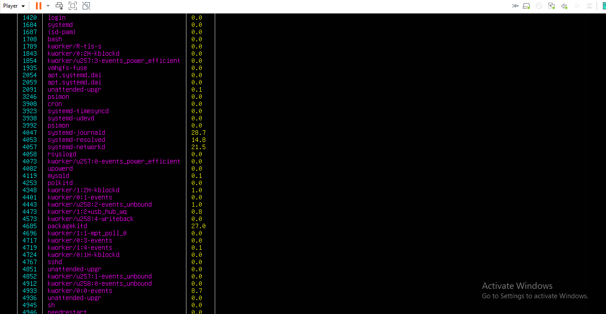

# Linux-CLI-Resource-Monitor
A terminal-based Python tool to monitor real-time CPU, memory, disk, and network usage with live CLI graphs — designed for headless or terminal-based Linux environments.

## ⚙️ Features

- 📊 Real-time graphical display in the terminal using `plotext`
- 🧠 Live stats for CPU, Memory, Disk, and Network usage
- 🔍 Process monitor with CPU usage display
- 📜 Log system metrics to a text file (`system_log.txt`)
- 🧰 Lightweight and dependency-efficient
- 🛠️ Built for CLI-based Linux environments (no GUI needed)
---
## 📸 Screenshots

### 🖥️ System Monitor (monitor.py)


### 🧠 Process Monitor (process_monitor.py)

---
## 📦 Requirements

- Python 3.6+
- [psutil](https://pypi.org/project/psutil/)
- [plotext](https://pypi.org/project/plotext/)
- [rich](https://pypi.org/project/rich/)
---
## Install dependencies:
```bash
pip install -r requirements.txt
```
---
## 🚀 Getting Started
Clone the Repository:

```bash
git clone https://github.com/yourusername/Linux-CLI-Resource-Monitor.git
cd Linux-CLI-Resource-Monitor
```
Make Scripts Executable

```bash
chmod +x monitor.py process_monitor.py
```
Run the System Monitor
```bash
./monitor.py
```
Run the Process Monitor
```bash
./process_monitor.py
```
---
## 📝 Log Output
Logged data will be saved in **system_log.txt** automatically.

## 🔮 Future Enhancements
- Support for exporting stats to CSV/JSON
- Email/Slack alerts for high resource usage
- CLI filters to monitor specific processes
- Docker container monitoring support
---
## 📌 Why This Project Stands Out
Unlike traditional GUI-based system monitors, Linux CLI Resource Monitor works entirely in the command line — perfect for remote servers and terminal environments. The CLI graphing interface offers an intuitive way to visualize system health live, even over SSH or headless Linux installs.

## 🧠 Ideal For
- Linux enthusiasts & CLI lovers
- DevOps beginners or professionals
- Resume/project portfolio enhancement
- Practicing real-time monitoring logic with Python
---
